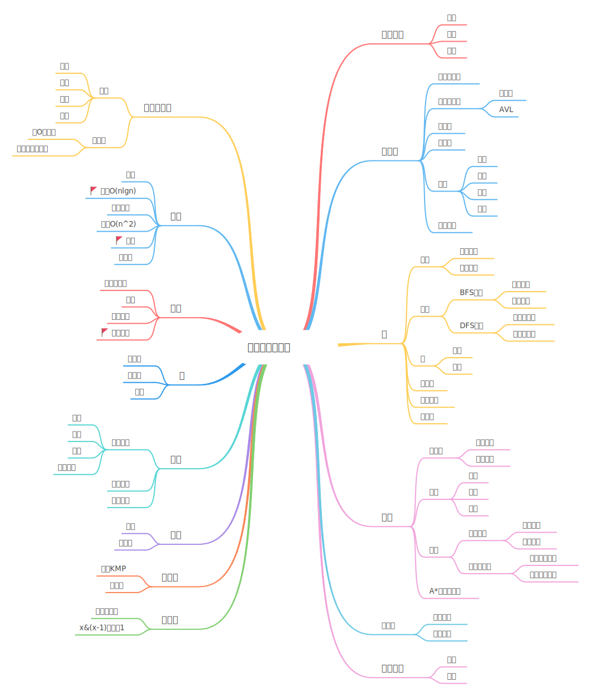

# 知识点

# 基础
- [x] 两数之和（简单）  
- [x] 20 有效的括号（简单）  
- [x] 字符串解码（中等）  
- [x] LRU 缓存机制（困难）  
- [x] 实现 Trie（前缀树）（中等）  
- [x] 211 添加与搜索单词 - 数据结构设计（中等）  
- [x] 单词搜索 II （困难）  
- [x] 找不同（简单）
- [x] 单词规律（简单）
- [x] 字符串中的第一个唯一字符（简单）
- [x] 无重复字符的最长子串（中等）
- [x] 最小覆盖子串（困难）~~NOTE~~ 
- [x] 合并两个有序链表（简单）
- [x] 环形链表（简单）
- [x] 环形链表 II （中等）
- [x] 反转链表（简单）
- [x] 反转链表 II （中等）
- [x] 旋转链表（中等）
- [x] 排序链表
- [x] 链表中倒数第 k 个节点
- [x] 两两交换链表中的节点（中等）
- [x] 905 按奇偶排序数组（简单）
- [x] 按奇偶排序数组 II （简单）
- [x] 977 有序数组的平方（简单）  
- [x] 852. 山脉数组的峰顶索引（简单）
- [x] 搜索旋转排序数组（困难）
- [x] 搜索旋转排序数组 II （中等）
- [x] 寻找旋转排序数组中的最小值（中等）
- [x] 寻找旋转排序数组中的最小值 II （困难）
- [x] 搜索二维矩阵（中等）
- [ ] 等式方程的可满足性（中等）
- [x] 朋友圈（中等）
- [ ] 账户合并（中等）

# 深度优先搜索
- [x] 104 二叉树的最大深度（简单）
- [ ] 112 路径总和（简单）
- [x] 113 路径总和 II （中等）
- [x] 130 被围绕的区域（中等）
- [x] 200 岛屿数量（中等）
- [x] 695 岛屿的最大面积（中等）
- [ ] 979 在二叉树中分配硬币（中等）

# 回溯
- [x] 22 括号生成（中等）
- [x] 51 N 皇后（困难）
- [x] 52 N 皇后 II （困难）
- [x] 解数独	（中等）
- [ ] 980 不同路径 III （困难）
- [x] 单词搜索（中等）

# 分治
- [x] 240 搜索二维矩阵 II （中等）
- [x] 23 合并 K 个排序链表（中等） 堆排序 
- [x] 241 为运算表达式设计优先级（中等）
- [ ] 给表达式添加运算符（困难）
- [x] 215 数组中的第 K 个最大元素（中等） 堆排序
- [ ] 973 最接近原点的 K 个点（中等）
- [ ] 鸡蛋掉落（困难）

# 动态规划
- [x] 使用最小花费爬楼梯（简单）
- [x] 爬楼梯（简单）
- [x] 不同路径（简单）
- [x] 最小路径和	（中等）
- [x] 53. 最大子序和	（简单）
- [ ] 152 乘积最大子数组（中等）
- [ ] 买卖股票的最佳时机（简单）
- [ ] 买卖股票的最佳时机 II （简单）
- [ ] 买卖股票的最佳时机 III （困难）
- [ ] 买卖股票的最佳时机 IV （困难）
- [ ] 最佳买卖股票时机含冷冻期（中等）
- [ ] 买卖股票的最佳时机含手续费（中等）
- [ ] 零钱兑换	（中等）
- [ ] 零钱兑换 II （中等）
- [ ] 编辑距离（困难）
- [ ] 不同的子序列（困难）
- [ ] 柱状图中最大的矩形（困难）
- [ ] 最大矩形（困难）
- [ ] 最大正方形（中等）
- [ ] 最低票价（中等）
- [ ] 区域和检索 - 数组不可变（简单）
- [ ] 二维区域和检索 - 矩阵不可变（中等）
- [ ] 最长上升子序列	（中等）
- [ ] 鸡蛋掉落（困难）
